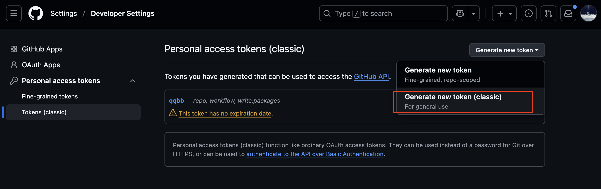
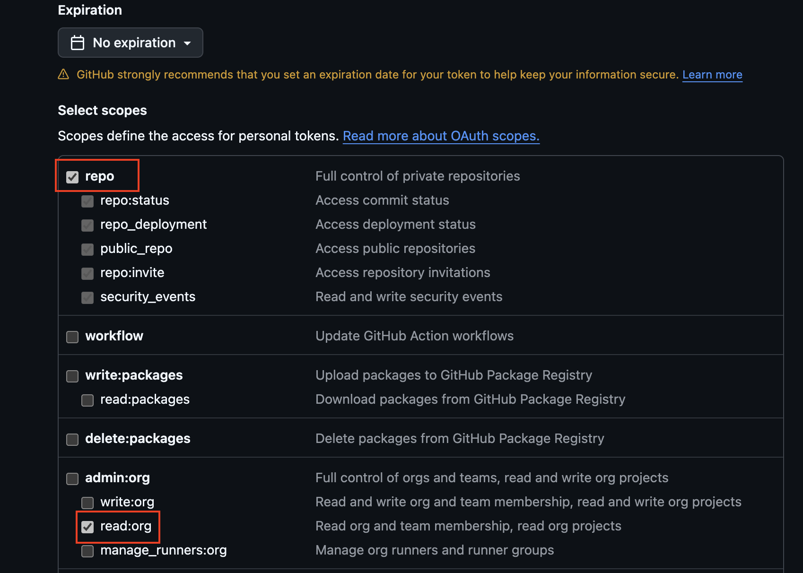

## 1 切换目录

首先, 请 cd 到本项目根目录;

```bash
cd ~/Documents/qqbb
```

## 2 一次性操作

然后, 请执行以下命令 (**以下命令仅需在最开始执行一次**) : 

### 2.1 安装并配置 gh:

```bash
brew install gh
gh auth login
```

然后按照下列选择进行选择:

```bash
? Where do you use GitHub? 
GitHub.com
? What is your preferred protocol for Git operations on this host? 
HTTPS
? Authenticate Git with your GitHub credentials? 
No
? How would you like to authenticate GitHub CLI? 
Paste an authentication token
Tip: you can generate a Personal Access Token here https://github.com/settings/tokens
The minimum required scopes are 'repo', 'read:org'.
```

**!!! 这里一定要注意选 Tokens (classic), 并且勾选 'repo' 和 'read:org' 权限; 如下图所示:**





```bash
? Paste your authentication token: ***********************************
- gh config set -h github.com git_protocol https
✓ Configured git protocol
✓ Logged in as raindream-yunzhui
```

### 2.2 赋予脚本执行权限

```bash
chmod +x dev.sh
```

## 3 执行脚本

最后, 请执行以下命令, 并根据终端输出进行笔记更新即可; 该脚本会帮你自动化所有指令:

```bash
./dev.sh
```
